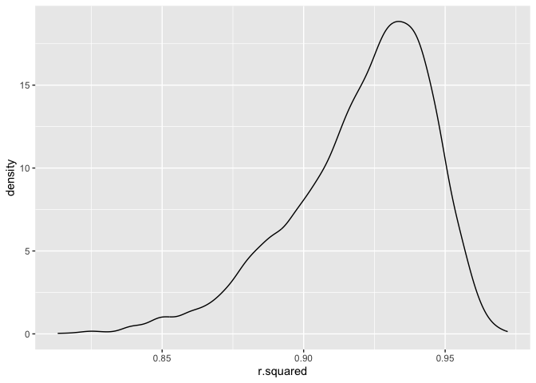
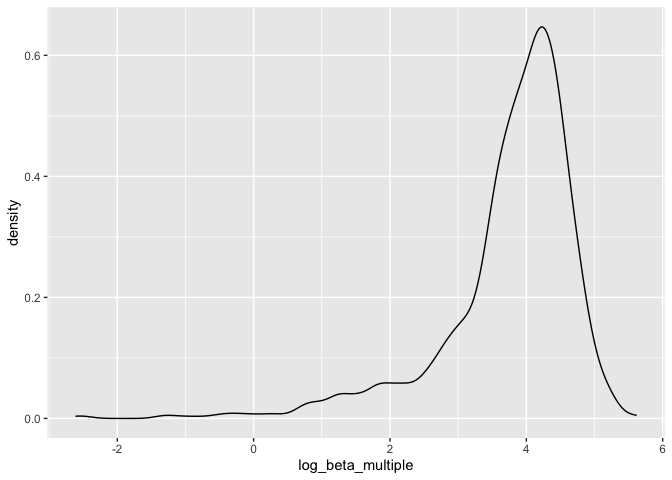
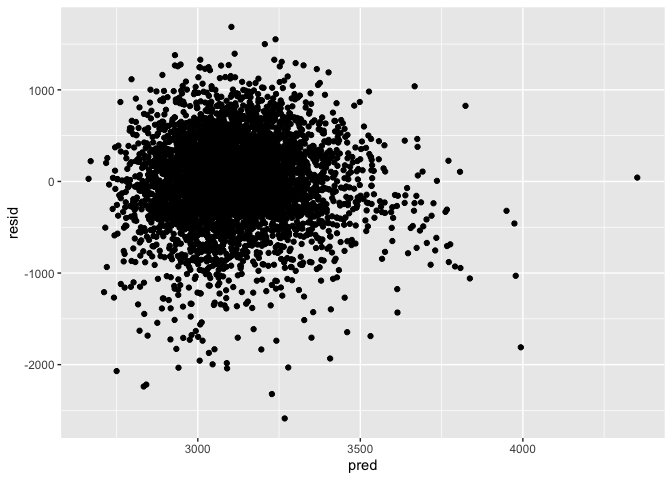
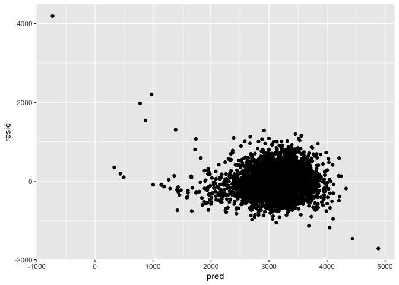
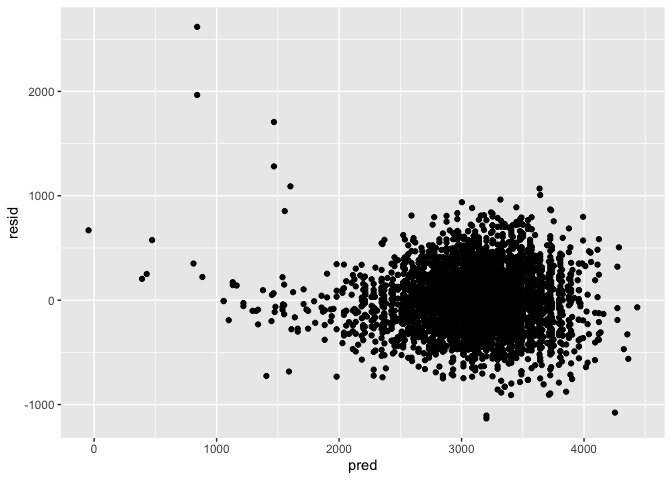
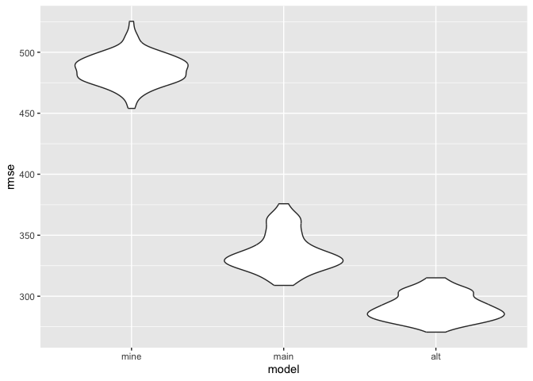

p8105_jl5934_hw6
================
Jesus Luevano
2023-11-17

``` r
library(tidyverse)
```

    ## ── Attaching core tidyverse packages ──────────────────────── tidyverse 2.0.0 ──
    ## ✔ dplyr     1.1.3     ✔ readr     2.1.4
    ## ✔ forcats   1.0.0     ✔ stringr   1.5.0
    ## ✔ ggplot2   3.4.3     ✔ tibble    3.2.1
    ## ✔ lubridate 1.9.2     ✔ tidyr     1.3.0
    ## ✔ purrr     1.0.2     
    ## ── Conflicts ────────────────────────────────────────── tidyverse_conflicts() ──
    ## ✖ dplyr::filter() masks stats::filter()
    ## ✖ dplyr::lag()    masks stats::lag()
    ## ℹ Use the conflicted package (<http://conflicted.r-lib.org/>) to force all conflicts to become errors

``` r
library(modelr)
library(purrr)
library(mgcv)
```

    ## Loading required package: nlme
    ## 
    ## Attaching package: 'nlme'
    ## 
    ## The following object is masked from 'package:dplyr':
    ## 
    ##     collapse
    ## 
    ## This is mgcv 1.9-0. For overview type 'help("mgcv-package")'.

``` r
library(caret)
```

    ## Loading required package: lattice
    ## 
    ## Attaching package: 'caret'
    ## 
    ## The following object is masked from 'package:purrr':
    ## 
    ##     lift

\#Problem 1 Create a city_state variable (e.g. “Baltimore, MD”), and a
binary variable indicating whether the homicide is solved. Omit cities
Dallas, TX; Phoenix, AZ; and Kansas City, MO – these don’t report victim
race. Also omit Tulsa, AL – this is a data entry mistake. For this
problem, limit your analysis those for whom victim_race is white or
black. Be sure that victim_age is numeric.

For the city of Baltimore, MD, use the glm function to fit a logistic
regression with resolved vs unresolved as the outcome and victim age,
sex and race as predictors. Save the output of glm as an R object; apply
the broom::tidy to this object; and obtain the estimate and confidence
interval of the adjusted odds ratio for solving homicides comparing male
victims to female victims keeping all other variables fixed.

Now run glm for each of the cities in your dataset, and extract the
adjusted odds ratio (and CI) for solving homicides comparing male
victims to female victims. Do this within a “tidy” pipeline, making use
of purrr::map, list columns, and unnest as necessary to create a
dataframe with estimated ORs and CIs for each city.

Create a plot that shows the estimated ORs and CIs for each city.
Organize cities according to estimated OR, and comment on the plot.

\#Problem 2 The boostrap is helpful when you’d like to perform inference
for a parameter / value / summary that doesn’t have an
easy-to-write-down distribution in the usual repeated sampling
framework. We’ll focus on a simple linear regression with tmax as the
response with tmin and prcp as the predictors, and are interested in the
distribution of two quantities estimated from these data:

r̂2 log(β̂1∗β̂2) Use 5000 bootstrap samples and, for each bootstrap sample,
produce estimates of these two quantities. Plot the distribution of your
estimates, and describe these in words. Using the 5000 bootstrap
estimates, identify the 2.5% and 97.5% quantiles to provide a 95%
confidence interval for r̂2 and log(β̂0∗β̂1). Note: broom::glance() is
helpful for extracting r̂2 from a fitted regression, and broom::tidy()
(with some additional wrangling) should help in computing log(β̂1∗β̂2).

Our goal is to create a linear model from the NOAA weather datasets to
predict maximum temperature `tmax` using the variables minimum
temperature `tmin` and precipitation `prcp`. From this we will isolate
the values of R2 of the model, and the log of the product of the Beta
statistics (B1 and B2) after bootstrapping 5000 times.

First we pull in the dataset.

``` r
weather_df = 
  rnoaa::meteo_pull_monitors(
    c("USW00094728"),
    var = c("PRCP", "TMIN", "TMAX"), 
    date_min = "2022-01-01",
    date_max = "2022-12-31") |>
  mutate(
    name = recode(id, USW00094728 = "CentralPark_NY"),
    tmin = tmin / 10,
    tmax = tmax / 10) |>
  select(name, id, everything())
```

    ## using cached file: /Users/JML/Library/Caches/org.R-project.R/R/rnoaa/noaa_ghcnd/USW00094728.dly

    ## date created (size, mb): 2023-10-01 15:25:03.322602 (8.525)

    ## file min/max dates: 1869-01-01 / 2023-09-30

We will set up the bootstrapping function such that it selects a quarter
of the total samples each time, with replacement, and creates 5000 new
subsets.

``` r
#lm(tmax ~ tmin + prcp, data = weather_df) %>%
 # broom::glance() #%>% #r.squared 
  #broom::tidy() #log(tibble[2,4]*tibble[3,4])

boot_sample = function(df) {
  sample_frac(tbl = df, size = .25, replace = TRUE)
}

boot_straps = 
  tibble(strap_number = 1:5000) |> 
  mutate(
    strap_sample = map(strap_number, \(i) boot_sample(df = weather_df))
  )

boot_straps
```

    ## # A tibble: 5,000 × 2
    ##    strap_number strap_sample     
    ##           <int> <list>           
    ##  1            1 <tibble [91 × 6]>
    ##  2            2 <tibble [91 × 6]>
    ##  3            3 <tibble [91 × 6]>
    ##  4            4 <tibble [91 × 6]>
    ##  5            5 <tibble [91 × 6]>
    ##  6            6 <tibble [91 × 6]>
    ##  7            7 <tibble [91 × 6]>
    ##  8            8 <tibble [91 × 6]>
    ##  9            9 <tibble [91 × 6]>
    ## 10           10 <tibble [91 × 6]>
    ## # ℹ 4,990 more rows

We will then utilize these bootstrapped subsets and map them over a
linear model to predict tmax utilizing tmin and precipitation. I have an
additional function to pull in the first cell, to pull out the rsquared
from the glance output. For the Betas we will run a separate function to
filter out the statistics for tmin and prcp, and mutate a new variable
that is the log of their products.

Both of these will be plotted to show the distribution of them.

``` r
keep_first_cell <- function(tbl) {
  if (nrow(tbl) == 1) {
    return(tbl[1, 1, drop = FALSE])
  } else {
    return(tbl)
  }
}

bootstrap_results = 
  boot_straps %>%
  mutate(
    models = map(strap_sample, \(df) lm(tmax ~ tmin + prcp, data = df)),
    results = map(models, broom::tidy),
    glance = map(models, broom::glance),
    rsquared = map(glance, keep_first_cell)) %>%
  select(-strap_sample, -models, -glance) %>%
  unnest(c(results, rsquared))

bootstrap_results %>%
  ggplot(aes(x = r.squared)) + 
  geom_density()
```

<!-- -->

``` r
log_betas = bootstrap_results %>%
  filter(term %in% c("tmin", "prcp")) %>%
  group_by(strap_number) %>%
  summarize(beta_multiple = prod(statistic)) %>%
  mutate(log_beta_multiple = log(beta_multiple))
```

    ## Warning: There was 1 warning in `mutate()`.
    ## ℹ In argument: `log_beta_multiple = log(beta_multiple)`.
    ## Caused by warning in `log()`:
    ## ! NaNs produced

``` r
log_betas %>%
  ggplot(aes(x = log_beta_multiple)) +
  geom_density()
```

    ## Warning: Removed 3746 rows containing non-finite values (`stat_density()`).

<!-- -->

Next to find the upper and lower quantile (at 0.025 and 0.975 each) we
will use the quantile function.

``` r
# Assuming bootstrapped_r2 is a vector of your 5000 bootstrap estimates for R^2
lower_r2 <- quantile(bootstrap_results$r.squared, 0.025)
upper_r2 <- quantile(bootstrap_results$r.squared, 0.975)

# Assuming bootstrapped_log_beta is a vector of your 5000 bootstrap estimates for log(beta0 * beta1), how to deal w/ NaNs? from negative values
lower_log_beta <- quantile(log_betas$log_beta_multiple, 0.025, na.rm = TRUE)
upper_log_beta <- quantile(log_betas$log_beta_multiple, 0.975, na.rm = TRUE)
```

\#Problem 3 In this problem, you will analyze data gathered to
understand the effects of several variables on a child’s birthweight.
This dataset, available here, consists of roughly 4000 children and
includes the following variables:

babysex: baby’s sex (male = 1, female = 2) bhead: baby’s head
circumference at birth (centimeters) blength: baby’s length at birth
(centimeteres) bwt: baby’s birth weight (grams) delwt: mother’s weight
at delivery (pounds) fincome: family monthly income (in hundreds,
rounded) frace: father’s race (1 = White, 2 = Black, 3 = Asian, 4 =
Puerto Rican, 8 = Other, 9 = Unknown) gaweeks: gestational age in weeks
malform: presence of malformations that could affect weight (0 = absent,
1 = present) menarche: mother’s age at menarche (years) mheigth:
mother’s height (inches) momage: mother’s age at delivery (years) mrace:
mother’s race (1 = White, 2 = Black, 3 = Asian, 4 = Puerto Rican, 8 =
Other) parity: number of live births prior to this pregnancy pnumlbw:
previous number of low birth weight babies pnumgsa: number of prior
small for gestational age babies ppbmi: mother’s pre-pregnancy BMI ppwt:
mother’s pre-pregnancy weight (pounds) smoken: average number of
cigarettes smoked per day during pregnancy wtgain: mother’s weight gain
during pregnancy (pounds) Load and clean the data for regression
analysis (i.e. convert numeric to factor where appropriate, check for
missing data, etc.).

Propose a regression model for birthweight. This model may be based on a
hypothesized structure for the factors that underly birthweight, on a
data-driven model-building process, or a combination of the two.
Describe your modeling process and show a plot of model residuals
against fitted values – use add_predictions and add_residuals in making
this plot.

Compare your model to two others:

One using length at birth and gestational age as predictors (main
effects only) One using head circumference, length, sex, and all
interactions (including the three-way interaction) between these Make
this comparison in terms of the cross-validated prediction error; use
crossv_mc and functions in purrr as appropriate.

Note that although we expect your model to be reasonable, model building
itself is not a main idea of the course and we don’t necessarily expect
your model to be “optimal”.

In this problem we will utilize the birthweight dataframe to evaluate
different models using the cross-validation functions.

- First we import that data, clean the names, mutate variables to make
  new factors of sex, father’s race, mother’s race, and malformation.

``` r
birthweight.df <- read_csv("data/birthweight.csv") %>%
  janitor::clean_names() %>%
  mutate(
    sex = as.factor(ifelse(babysex == 1, "male", "female")),
    father_race = as.factor(case_when(
      frace == "1" ~ "White",
      frace == "2" ~ "Black",
      frace == "3" ~ "Asian",
      frace == "4" ~ "Puerto Rican",
      frace == "8" ~ "Other", 
      frace == "9" ~ "Unknown"
    )),
    malformation = as.factor(ifelse(malform == 1, "malformed", "non_malformed")),
    mother_race = as.factor(case_when(
      mrace == "1" ~ "White",
      mrace == "2" ~ "Black",
      mrace == "3" ~ "Asian",
      mrace == "4" ~ "Puerto Rican",
      mrace == "8" ~ "Other"
    ))
  ) %>%
  dplyr::select(-c(babysex, frace, mrace, malform, pnumlbw, pnumsga))
```

    ## Rows: 4342 Columns: 20
    ## ── Column specification ────────────────────────────────────────────────────────
    ## Delimiter: ","
    ## dbl (20): babysex, bhead, blength, bwt, delwt, fincome, frace, gaweeks, malf...
    ## 
    ## ℹ Use `spec()` to retrieve the full column specification for this data.
    ## ℹ Specify the column types or set `show_col_types = FALSE` to quiet this message.

I have constructed a model to predict birthweight (`bwt`), that
considers socioeconomic demographic factors under that assumption that
they are surrogates for health and healthcare access. I chose to model a
linear model of `bwt` that relies on family monthly income, mother’s
weight at delivery, and maternal age.

This model will be named `fit_mine`.

``` r
fit_mine = lm(bwt ~ fincome + delwt + momage, data = birthweight.df) 

birthweight.df %>%
  modelr::add_residuals(fit_mine) %>%
  modelr::add_predictions(fit_mine) %>%
  ggplot(aes(x = pred, y = resid)) +
  geom_point()
```

<!-- -->

Next we will construct the models described by the homework.

- The Main model will be named `fit_main`, and predicts birthweight from
  baby’s length at birth and gestational age in weeks.

- The alternative model will be named `fit_alt`, and predicts
  birthweight from baby’s head circumference, baby’s length at birth,
  the sex of the baby, and interaction terms amongst them all: baby’s
  head circumference \* baby’s length at birth, baby’s head
  circumference \* sex of baby, baby’s length at birth \* baby’s sex,
  and baby’s head circumference \* baby’s length at birth \* baby’s sex.

``` r
fit_main = lm(bwt ~ blength + gaweeks, data = birthweight.df)
birthweight.df %>%
  modelr::add_residuals(fit_main) %>%
  modelr::add_predictions(fit_main) %>%
  ggplot(aes(x = pred, y = resid)) +
  geom_point()
```

<!-- -->

``` r
fit_alt = lm(bwt ~ bhead + blength + sex + bhead*blength + bhead*sex + blength*sex + bhead*blength*sex, data = birthweight.df)
birthweight.df %>%
  modelr::add_residuals(fit_alt) %>%
  modelr::add_predictions(fit_alt) %>%
  ggplot(aes(x = pred, y = resid)) +
  geom_point()
```

<!-- -->

Next we will set up cross validation of 100 splits. This will include
variables for the each of the three above models, mapping the models
across the cross-validation dataframe. We will then then calculate the
RMSE for each of those models by mapping across them.

``` r
cv_df = 
  crossv_mc(birthweight.df, 100) 

cv_df = 
  cv_df |> 
  mutate(
    fit_mine  = map(train, \(df) lm(bwt ~ fincome + delwt + momage, data = df)), #fit_mine = lm(bwt ~ fincome + delwt + momage, data = birthweight.df) 
    fit_main  = map(train, \(df) lm(bwt ~ blength + gaweeks, data = df)), #fit_main = lm(bwt ~ blength + gaweeks, data = birthweight.df)
    fit_alt  = map(train, \(df) lm(bwt ~ bhead + blength + sex + bhead*blength + bhead*sex + blength*sex + bhead*blength*sex, data = df))) |>  #fit_alt = lm(bwt ~ bhead + blength + sex + bhead*blength + bhead*sex + blength*sex + bhead*blength*sex, data = birthweight.df)
  mutate(
    rmse_mine = map2_dbl(fit_mine, test, \(mod, df) rmse(model = mod, data = df)),
    rmse_main = map2_dbl(fit_main, test, \(mod, df) rmse(model = mod, data = df)),
    rmse_alt = map2_dbl(fit_alt, test, \(mod, df) rmse(model = mod, data = df)))
```

Lastly we will plot the density of the RMSE of the cross-validations to
see which model is optimal.

``` r
cv_df |> 
  select(starts_with("rmse")) |> 
  pivot_longer(
    everything(),
    names_to = "model", 
    values_to = "rmse",
    names_prefix = "rmse_") |> 
  mutate(model = fct_inorder(model)) |> 
  ggplot(aes(x = model, y = rmse)) + geom_violin()
```

<!-- -->

- The model with highest RMSE was my own, whereas the alternative that
  included more variables and interaction terms had the lowest spread of
  RMSE values. This suggests it is the more accurate amongst them.
