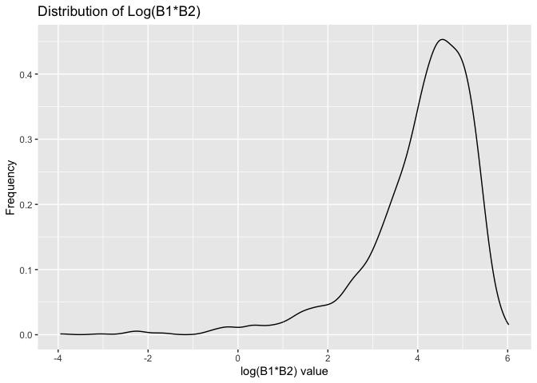
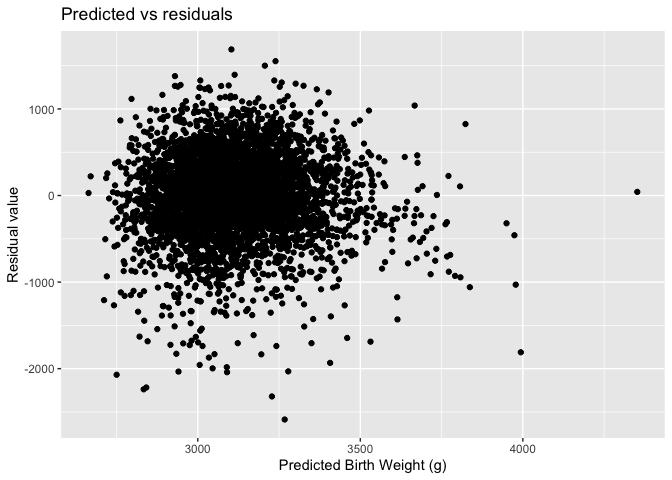

p8105_jl5934_hw6
================
Jesus Luevano
2023-11-17

``` r
library(tidyverse)
```

    ## ── Attaching core tidyverse packages ──────────────────────── tidyverse 2.0.0 ──
    ## ✔ dplyr     1.1.3     ✔ readr     2.1.4
    ## ✔ forcats   1.0.0     ✔ stringr   1.5.0
    ## ✔ ggplot2   3.4.3     ✔ tibble    3.2.1
    ## ✔ lubridate 1.9.2     ✔ tidyr     1.3.0
    ## ✔ purrr     1.0.2     
    ## ── Conflicts ────────────────────────────────────────── tidyverse_conflicts() ──
    ## ✖ dplyr::filter() masks stats::filter()
    ## ✖ dplyr::lag()    masks stats::lag()
    ## ℹ Use the conflicted package (<http://conflicted.r-lib.org/>) to force all conflicts to become errors

``` r
library(modelr)
library(purrr)
library(mgcv)
```

    ## Loading required package: nlme
    ## 
    ## Attaching package: 'nlme'
    ## 
    ## The following object is masked from 'package:dplyr':
    ## 
    ##     collapse
    ## 
    ## This is mgcv 1.9-0. For overview type 'help("mgcv-package")'.

``` r
library(caret)
```

    ## Loading required package: lattice
    ## 
    ## Attaching package: 'caret'
    ## 
    ## The following object is masked from 'package:purrr':
    ## 
    ##     lift

# Problem 1

For this problem we will utilize the Washington post data on homicides,
to evaluate a generalized logistic regression model to predict resolved
cases based on victim age, victim sex, and victim race.

First we import and clean the data for our purposes.

``` r
WaPo.df <- read_csv("data/homicide-data.csv") %>%
  janitor::clean_names() %>%
  mutate(city_state = 
           paste0(city,", ",state),
         victim_age = as.numeric(victim_age),
         resolved = ifelse(disposition == "Closed by arrest", 1, 0)) %>%
  filter(!(city_state %in% c("Dallas, TX", "Phoenix, AZ", "Kansas City, MO", "Tulsa, AL"))) %>%
  subset(victim_race %in% c("White", "Black"))
```

    ## Rows: 52179 Columns: 12
    ## ── Column specification ────────────────────────────────────────────────────────
    ## Delimiter: ","
    ## chr (9): uid, victim_last, victim_first, victim_race, victim_age, victim_sex...
    ## dbl (3): reported_date, lat, lon
    ## 
    ## ℹ Use `spec()` to retrieve the full column specification for this data.
    ## ℹ Specify the column types or set `show_col_types = FALSE` to quiet this message.

    ## Warning: There was 1 warning in `mutate()`.
    ## ℹ In argument: `victim_age = as.numeric(victim_age)`.
    ## Caused by warning:
    ## ! NAs introduced by coercion

Next we trial the model on solely Baltimore, MD.

``` r
Balt_model = WaPo.df %>%
  filter(city_state == "Baltimore, MD") |>
  glm(resolved ~ victim_age + victim_sex + victim_race, data = _, family = binomial()) %>%
  broom::tidy() %>%
  filter(term == "victim_sexMale") %>%
  mutate(OR = exp(estimate),
         lower_CI = OR - 1.96*std.error,
         upper_CI = OR + 1.96*std.error) %>%
  knitr::kable()
```

Now we create a model that works for all the cities to output an OR of
homcide being resolved based on victim sex of male vs female, and
calculate the upper and lower confidence intervals.

``` r
cities = as.vector(unique(WaPo.df$city_state))

OR_sex = function(x) {
  
  model <- WaPo.df %>%
  filter(city_state == x) |>
  glm(resolved ~ victim_age + victim_sex + victim_race, data = _, family = binomial()) %>%
  broom::tidy() %>%
  filter(term == "victim_sexMale") %>%
  mutate(OR = exp(estimate),
         lower_CI = OR - 1.96*std.error,
         upper_CI = OR + 1.96*std.error)
  
  tibble(
    city = x,
    OR = model[["OR"]],
    CI_low = model[["lower_CI"]],
    CI_upper = model[["upper_CI"]]
)
  
}

WaPo_ORs = map(cities, OR_sex) %>%
  bind_rows()
```

Lastly, we plot the the OR of each city, ordered by increasing OR, and
error bars for the CI.

``` r
ggplot(WaPo_ORs, aes(x = fct_reorder(city, OR), y = OR)) +
  geom_point(stat = "identity") +
  geom_errorbar(aes(ymin = CI_low, ymax = CI_upper)) + 
  theme(axis.text.x = element_text(angle = 45, size = 5, hjust = 1))
```

<!-- -->

- We see that there is some range in CI, with smaller ranges in certain
  cities like Chicago, IL and Detroit, MI.

# Problem 2

Our goal is to create a linear model from the NOAA weather datasets to
predict maximum temperature `tmax` using the variables minimum
temperature `tmin` and precipitation `prcp`. From this we will isolate
the values of R2 of the model, and the log of the product of the Beta
statistics (B1 and B2) after bootstrapping 5000 times.

First we pull in the dataset.

``` r
weather_df = 
  rnoaa::meteo_pull_monitors(
    c("USW00094728"),
    var = c("PRCP", "TMIN", "TMAX"), 
    date_min = "2022-01-01",
    date_max = "2022-12-31") |>
  mutate(
    name = recode(id, USW00094728 = "CentralPark_NY"),
    tmin = tmin / 10,
    tmax = tmax / 10) |>
  select(name, id, everything())
```

    ## using cached file: /Users/JML/Library/Caches/org.R-project.R/R/rnoaa/noaa_ghcnd/USW00094728.dly

    ## date created (size, mb): 2023-10-01 15:25:03.322602 (8.525)

    ## file min/max dates: 1869-01-01 / 2023-09-30

We will set up the bootstrapping function such that it selects a quarter
of the total samples each time, with replacement, and creates 5000 new
subsets.

``` r
#lm(tmax ~ tmin + prcp, data = weather_df) %>%
 # broom::glance() #%>% #r.squared 
  #broom::tidy() #log(tibble[2,4]*tibble[3,4])

boot_sample = function(df) {
  sample_frac(tbl = df, size = .25, replace = TRUE)
}

boot_straps = 
  tibble(strap_number = 1:5000) |> 
  mutate(
    strap_sample = map(strap_number, \(i) boot_sample(df = weather_df))
  )

boot_straps
```

    ## # A tibble: 5,000 × 2
    ##    strap_number strap_sample     
    ##           <int> <list>           
    ##  1            1 <tibble [91 × 6]>
    ##  2            2 <tibble [91 × 6]>
    ##  3            3 <tibble [91 × 6]>
    ##  4            4 <tibble [91 × 6]>
    ##  5            5 <tibble [91 × 6]>
    ##  6            6 <tibble [91 × 6]>
    ##  7            7 <tibble [91 × 6]>
    ##  8            8 <tibble [91 × 6]>
    ##  9            9 <tibble [91 × 6]>
    ## 10           10 <tibble [91 × 6]>
    ## # ℹ 4,990 more rows

We will then utilize these bootstrapped subsets and map them over a
linear model to predict tmax utilizing tmin and precipitation. I have an
additional function to pull in the first cell, to pull out the rsquared
from the glance output. For the Betas we will run a separate function to
filter out the statistics for tmin and prcp, and mutate a new variable
that is the log of their products.

Both of these will be plotted to show the distribution of them.

``` r
keep_first_cell <- function(tbl) {
  if (nrow(tbl) == 1) {
    return(tbl[1, 1, drop = FALSE])
  } else {
    return(tbl)
  }
}

bootstrap_results = 
  boot_straps %>%
  mutate(
    models = map(strap_sample, \(df) lm(tmax ~ tmin + prcp, data = df)),
    results = map(models, broom::tidy),
    glance = map(models, broom::glance),
    rsquared = map(glance, keep_first_cell)) %>%
  select(-strap_sample, -models, -glance) %>%
  unnest(c(results, rsquared))

bootstrap_results %>%
  ggplot(aes(x = r.squared)) + 
  geom_density() +
  labs(title = "Distribution of R-Squared",
       x = "R^2 value",
       y = "Frequency")
```

<!-- -->

- Our distribution of R2 values are primarily located at around 0.93,
  with a left sided tail nearing zero below 0.8. As the R2 values are
  the proportion of `tmax` explained by the predictors, the predominance
  of values near 0.90 shows the model has a good fit.

``` r
log_betas = bootstrap_results %>%
  filter(term %in% c("tmin", "prcp")) %>%
  group_by(strap_number) %>%
  summarize(beta_multiple = prod(statistic)) %>%
  mutate(log_beta_multiple = log(beta_multiple))
```

    ## Warning: There was 1 warning in `mutate()`.
    ## ℹ In argument: `log_beta_multiple = log(beta_multiple)`.
    ## Caused by warning in `log()`:
    ## ! NaNs produced

``` r
log_betas %>%
  ggplot(aes(x = log_beta_multiple)) +
  geom_density() +
  labs(title = )
```

    ## Warning: Removed 3724 rows containing non-finite values (`stat_density()`).

<!-- -->

- Our distribution of log(B1\*B2) values are primarily located at 4.2,
  with a leftward tail extended below zero. This demonstrates that there
  may be some joint effect between the predictor variables.

Next to find the upper and lower quantile (at 0.025 and 0.975 each) we
will use the quantile function.

``` r
# Assuming bootstrapped_r2 is a vector of your 5000 bootstrap estimates for R^2
lower_r2 <- quantile(bootstrap_results$r.squared, 0.025)
upper_r2 <- quantile(bootstrap_results$r.squared, 0.975)

# Assuming bootstrapped_log_beta is a vector of your 5000 bootstrap estimates for log(beta0 * beta1), how to deal w/ NaNs? from negative values
lower_log_beta <- quantile(log_betas$log_beta_multiple, 0.025, na.rm = TRUE)
upper_log_beta <- quantile(log_betas$log_beta_multiple, 0.975, na.rm = TRUE)
```

- For R2 the lower quantile at 2.5% is 0.8637678, whereas the upper
  quantile at 97.5% is 0.9558145. Thus the 95% CI is between those two
  values.

- For log(B1\*B2) the lower quantile at 2.5% is 0.9941103, whereas the
  upper quantile at 97.5% is 4.940135. Thus the 95% CI is between those
  two values.

# Problem 3

In this problem we will utilize the birth-weight dataframe to evaluate
different models using the cross-validation functions.

- First we import that data, clean the names, mutate variables to make
  new factors of sex, father’s race, mother’s race, and malformation.

``` r
birthweight.df <- read_csv("data/birthweight.csv") %>%
  janitor::clean_names() %>%
  mutate(
    sex = as.factor(ifelse(babysex == 1, "male", "female")),
    father_race = as.factor(case_when(
      frace == "1" ~ "White",
      frace == "2" ~ "Black",
      frace == "3" ~ "Asian",
      frace == "4" ~ "Puerto Rican",
      frace == "8" ~ "Other", 
      frace == "9" ~ "Unknown"
    )),
    malformation = as.factor(ifelse(malform == 1, "malformed", "non_malformed")),
    mother_race = as.factor(case_when(
      mrace == "1" ~ "White",
      mrace == "2" ~ "Black",
      mrace == "3" ~ "Asian",
      mrace == "4" ~ "Puerto Rican",
      mrace == "8" ~ "Other"
    ))
  ) %>%
  dplyr::select(-c(babysex, frace, mrace, malform, pnumlbw, pnumsga))
```

    ## Rows: 4342 Columns: 20
    ## ── Column specification ────────────────────────────────────────────────────────
    ## Delimiter: ","
    ## dbl (20): babysex, bhead, blength, bwt, delwt, fincome, frace, gaweeks, malf...
    ## 
    ## ℹ Use `spec()` to retrieve the full column specification for this data.
    ## ℹ Specify the column types or set `show_col_types = FALSE` to quiet this message.

- The model has 4342 observations and 18 variables named .

I have constructed a model to predict birthweight (`bwt`), that
considers socioeconomic demographic factors under that assumption that
they are surrogates for health and healthcare access. I chose to model a
linear model of `bwt` that relies on family monthly income, mother’s
weight at delivery, and maternal age.

This model will be named `fit_mine`.

``` r
fit_mine = lm(bwt ~ fincome + delwt + momage, data = birthweight.df) 

fit_mine %>%
  broom::tidy() %>%
  knitr::kable()
```

| term        |    estimate |  std.error | statistic | p.value |
|:------------|------------:|-----------:|----------:|--------:|
| (Intercept) | 1871.796675 | 59.9244446 | 31.235945 |   0e+00 |
| fincome     |    2.369337 |  0.2986105 |  7.934541 |   0e+00 |
| delwt       |    6.411904 |  0.3314487 | 19.345088 |   0e+00 |
| momage      |   10.084786 |  2.0044870 |  5.031106 |   5e-07 |

Model interpretations:

- We would not interpret the intercept as family income, mother’s weight
  and age would not be zero.

- The expected change per \$1 increase in family monthly income is an
  increase in weight of 2.37 grams, with all other predictors held
  constant.

- The expected change per one pound increase in maternal weight at
  delivery is an increase in birth weight of 6.41 grams, with all other
  predictors held constant.

- The expected change per one year increase in maternal age at delivery
  is increase of 10.08 grams, with all other predictors held constant.

``` r
birthweight.df %>%
  modelr::add_residuals(fit_mine) %>%
  modelr::add_predictions(fit_mine) %>%
  ggplot(aes(x = pred, y = resid)) +
  geom_point()
```

<!-- -->

Here we demonstrate a plot of the model’s predicted values for
birthweight plotted against the residual values from my model. There is
wide variability to the residuals, with most from -1000 to +1000, and
most of the predicted values being \<3500 for birthweight.

### Next we will construct the models described by the homework.

The Main model will be named `fit_main`, and predicts birthweight from
baby’s length at birth and gestational age in weeks.

``` r
fit_main = lm(bwt ~ blength + gaweeks, data = birthweight.df)
fit_main %>%
  broom::tidy() %>%
  knitr::kable()
```

| term        |    estimate | std.error | statistic | p.value |
|:------------|------------:|----------:|----------:|--------:|
| (Intercept) | -4347.66707 | 97.958360 | -44.38281 |       0 |
| blength     |   128.55569 |  1.989891 |  64.60439 |       0 |
| gaweeks     |    27.04673 |  1.717930 |  15.74379 |       0 |

``` r
birthweight.df %>%
  modelr::add_residuals(fit_main) %>%
  modelr::add_predictions(fit_main) %>%
  ggplot(aes(x = pred, y = resid)) +
  geom_point() 
```

<!-- -->

Model interpretations:

- Per each additional increase of baby’s birth length of 1 unit, the
  estimated change in birth weight is 128.56 gram increase, all other
  predictors held constant.

- Per each additional gestational week of age, the estimated change in
  birth weight is 27.05 gram increase, all other predictors held
  constant.

  - Looking at the residual plot, compared to my model the residuals are
    a bit tighter but the spread is still from -1000 to +1000, although
    there is a greater range of predicted birthweights.

The alternative model will be named `fit_alt`, and predicts birthweight
from baby’s head circumference, baby’s length at birth, the sex of the
baby, and interaction terms amongst them all: baby’s head circumference
\* baby’s length at birth, baby’s head circumference \* sex of baby,
baby’s length at birth \* baby’s sex, and baby’s head circumference \*
baby’s length at birth \* baby’s sex.

``` r
fit_alt = lm(bwt ~ bhead + blength + sex + bhead*blength + bhead*sex + blength*sex + bhead*blength*sex, data = birthweight.df)

fit_alt %>%
  broom::tidy() %>%
  knitr::kable()
```

| term                  |     estimate |    std.error |  statistic |   p.value |
|:----------------------|-------------:|-------------:|-----------:|----------:|
| (Intercept)           |  -801.948671 | 1102.3077046 | -0.7275180 | 0.4669480 |
| bhead                 |   -16.597546 |   34.0916082 | -0.4868514 | 0.6263883 |
| blength               |   -21.645964 |   23.3720477 | -0.9261475 | 0.3544209 |
| sexmale               | -6374.868351 | 1677.7669213 | -3.7996150 | 0.0001469 |
| bhead:blength         |     3.324444 |    0.7125586 |  4.6655020 | 0.0000032 |
| bhead:sexmale         |   198.393181 |   51.0916850 |  3.8830816 | 0.0001047 |
| blength:sexmale       |   123.772887 |   35.1185360 |  3.5244319 | 0.0004288 |
| bhead:blength:sexmale |    -3.878053 |    1.0566296 | -3.6702106 | 0.0002453 |

``` r
birthweight.df %>%
  modelr::add_residuals(fit_alt) %>%
  modelr::add_predictions(fit_alt) %>%
  ggplot(aes(x = pred, y = resid)) +
  geom_point()
```

<!-- -->

To interpret the changes per value, we must now consider the value of
the predictor’s Beta, as well as the interaction terms.

- The second models residual plot when compared to the prior two models,
  the residual range is a bit tighter now primarily focused in -500 to
  +500, with still a wide range of predicted values similar to the main
  model.

Next we will set up cross validation of 100 splits. This will include
variables for the each of the three above models, mapping the models
across the cross-validation dataframe. We will then then calculate the
RMSE for each of those models by mapping across them.

``` r
cv_df = 
  crossv_mc(birthweight.df, 100) 

cv_df = 
  cv_df |> 
  mutate(
    fit_mine  = map(train, \(df) lm(bwt ~ fincome + delwt + momage, data = df)), #fit_mine = lm(bwt ~ fincome + delwt + momage, data = birthweight.df) 
    fit_main  = map(train, \(df) lm(bwt ~ blength + gaweeks, data = df)), #fit_main = lm(bwt ~ blength + gaweeks, data = birthweight.df)
    fit_alt  = map(train, \(df) lm(bwt ~ bhead + blength + sex + bhead*blength + bhead*sex + blength*sex + bhead*blength*sex, data = df))) |>  #fit_alt = lm(bwt ~ bhead + blength + sex + bhead*blength + bhead*sex + blength*sex + bhead*blength*sex, data = birthweight.df)
  mutate(
    rmse_mine = map2_dbl(fit_mine, test, \(mod, df) rmse(model = mod, data = df)),
    rmse_main = map2_dbl(fit_main, test, \(mod, df) rmse(model = mod, data = df)),
    rmse_alt = map2_dbl(fit_alt, test, \(mod, df) rmse(model = mod, data = df)))
```

Lastly we will plot the density of the RMSE of the cross-validations to
see which model is optimal.

``` r
cv_df |> 
  select(starts_with("rmse")) |> 
  pivot_longer(
    everything(),
    names_to = "model", 
    values_to = "rmse",
    names_prefix = "rmse_") |> 
  mutate(model = fct_inorder(model)) |> 
  ggplot(aes(x = model, y = rmse)) + geom_violin()
```

<!-- -->

- The model with highest RMSE was my own, whereas the alternative that
  included more variables and interaction terms had the lowest spread of
  RMSE values. This suggests it is the more accurate amongst them.
